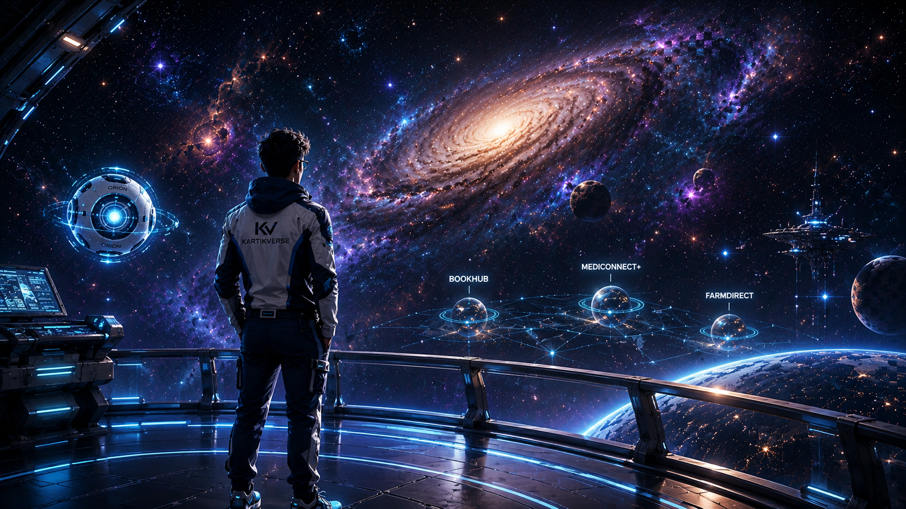

# 🌌 KartikVerse



> **Step into KartikVerse** — A premium, highly-interactive digital universe built by Kartik Agrawal.

KartikVerse isn't just a portfolio; it's a cinematic exploration of my software engineering journey. Built with cutting-edge web technologies, it features immersive GSAP animations, a custom physics engine, and dynamic worlds representing my core projects.

## ✨ Features

- **Cinematic Intro:** A video-powered introduction that seamlessly transitions into the 3D-inspired universe.
- **Scroll-Snapping Timeline:** Buttery-smooth, scroll-driven navigation through the entire portfolio using GSAP ScrollTrigger.
- **ORION Control Center:** A fully functional, interactive companion UI that controls Universe Settings (Music, Particles, Performance Mode).
- **Dynamic Audio Engine:** Context-aware background music that fades dynamically based on your location in the universe.
- **Secure Mission Terminal:** A built-in communication system that directly connects visitors to my inbox.

## 🚀 The Worlds (Projects)

- 📖 **BookHub:** Global Literary Ecosystem (React, Node.js, MongoDB)
- 🏥 **MediConnect+:** Next-Generation Healthcare Infrastructure
- 🌱 **FarmDirect:** Connecting Farmers Directly to Opportunity
- 🍔 **Flavor Haven:** Premium Culinary Platform

## 🛠️ Technology Stack

- **Framework:** [Next.js 16](https://nextjs.org/) (App Router)
- **Styling:** [Tailwind CSS](https://tailwindcss.com/)
- **Animation:** [GSAP](https://gsap.com/) (ScrollTrigger, Timelines) & [Framer Motion](https://www.framer.com/motion/)
- **State Management:** [Zustand](https://github.com/pmndrs/zustand)
- **Icons:** [Lucide React](https://lucide.dev/)

## 💻 Getting Started

First, install the dependencies:
```bash
npm install
```

Then, run the development server:
```bash
npm run dev
```

Open [http://localhost:3000](http://localhost:3000) with your browser to explore the universe locally.

## 🔗 Connect

- **LinkedIn:** [kartik221203](https://www.linkedin.com/in/kartik221203/)
- **Email:** kartik221203@gmail.com
- **GitHub:** [Agkartik](https://github.com/Agkartik)

---
*Built with ❤️ from Gurugram, Haryana to the Stars.*
